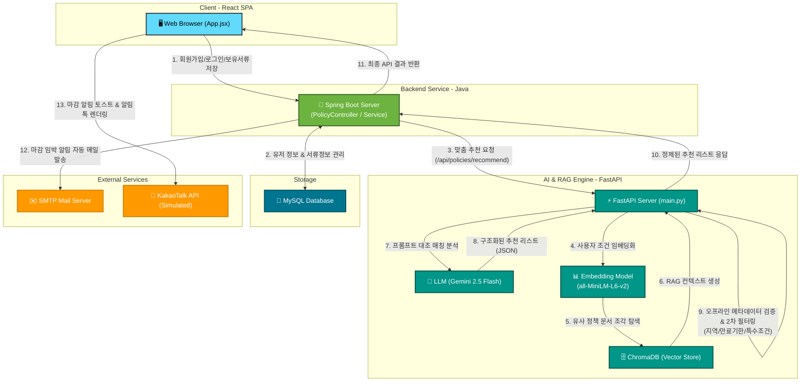
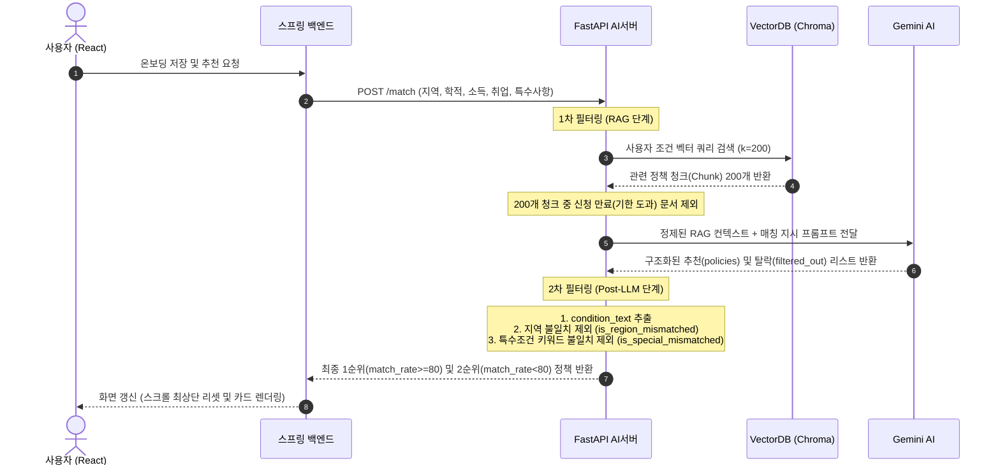
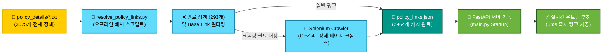

# Capstone Presentation Diagram & Visualization Guide (`draw.md`)

이 문서는 발표 PPT 제작을 위한 **시각 자료 배치 가이드** 및 **다이어그램 소스 코드(Mermaid / DBML)** 모음집입니다. 각 다이어그램이 몇 번 슬라이드에 배치되어야 하는지, 어떤 도구(사이트)에서 그려야 하는지, 그리고 즉시 복사하여 사용할 수 있는 코드를 정리했습니다.

---

## ⏱️ 슬라이드별 시각 자료 배치 요약표

| 슬라이드 번호 | 슬라이드 주제 | 배치할 시각 자료 및 다이어그램 | 추천 제작 사이트 |
| :--- | :--- | :--- | :--- |
| **Slide 1** | **Motivation** | 분절된 청년 정책 서비스 실태 인포그래픽 | Figma / PPT 도형 |
| **Slide 2** | **Limitation** | 기존 플랫폼(정부24 등) vs 본 플랫폼 비교 매트릭스 표 | Markdown Table |
| **Slide 3** | **Background** | RAG (검색 증강 생성) 핵심 아키텍처 흐름 | Mermaid / Draw.io |
| **Slide 4** | **Tech Stack** | 프론트엔드 - 백엔드 - AI 엔진 기술 스택 블록다이어그램 | Figma / PPT 도형 |
| **Slide 5** | **Architecture** | **[메인] 전체 시스템 아키텍처 및 흐름도** | Mermaid / Draw.io |
| **Slide 7** | **Evaluation** | 성능 비교 지표 (온보딩 소요 시간 비교 그래프) | Excel / PPT 차트 |
| **Slide 9** | **Trials & Errors** | 크롤링 방식 vs 오프라인 pre-resolution 성능 비교도 | Mermaid / Draw.io |
| **Slide 10** | **Conclusion** | 사용자 정보 기반 맞춤형 원스톱 복지 순환도 | Figma / PPT 도형 |

---

## 1. [Slide 5] 전체 시스템 아키텍처 (System Architecture)
* **목적**: 웹 브라우저, 스프링 부트(Spring Boot), FastAPI AI 엔진, MySQL 데이터베이스가 상호작용하는 전체 구조를 시각화합니다.
* **제작 사이트**: [Draw.io](https://app.diagrams.net/) 또는 [Mermaid Live Editor](https://mermaid.live/)



---

## 2. [Slide 3] RAG 및 매칭 프로세스 흐름도 (Sequence & Pipeline)
* **목적**: 사용자가 온보딩을 진행할 때 ChromaDB에서 문서를 찾고 AI 매칭 및 2차 필터링을 수행하는 상세 시퀀스 다이어그램입니다.
* **제작 사이트**: [Mermaid Live Editor](https://mermaid.live/)



---

## 3. [Slide 5] 데이터베이스 관계 스키마 (MySQL ERD)
* **목적**: 데이터베이스 테이블 관계 시각화
* **제작 사이트**: [dbdiagram.io](https://dbdiagram.io/)

```dbml
// dbdiagram.io 에 붙여넣을 코드
Table users {
  id integer [primary key, increment]
  username varchar [unique, not null]
  region varchar
  education varchar
  job varchar
  housing varchar
  housing_detail varchar
  income varchar
  birth_date varchar
  interest varchar
  email varchar
}

Table policies {
  id integer [primary key, increment]
  policy_name varchar [unique, not null]
  apply_link text
  detail_link text
  apply_method text
  eligibility text
  region varchar
  education varchar
  job varchar
  housing varchar
  housing_detail varchar
  income varchar
  interest varchar
  end_date varchar
  match_rate integer
  agency varchar
  reason text
  content text [not null]
}

Table policy_intents {
  id integer [primary key, increment]
  username varchar [not null]
  policy_id integer [not null]
  status varchar [not null]
  ignore_reason varchar
  reason text
  eligibility text
}

Table policy_required_docs {
  policy_id integer [not null]
  document_name varchar [not null]
}

Table policy_specials {
  policy_id integer [not null]
  special_name varchar [not null]
}

Table user_documents {
  id integer [primary key, increment]
  username varchar [not null]
  document_name varchar [not null]
}

Ref: policy_intents.policy_id > policies.id
Ref: policy_required_docs.policy_id > policies.id
Ref: policy_specials.policy_id > policies.id
Ref: policy_intents.username > users.username
Ref: user_documents.username > users.username
```

---

## 4. [Slide 9] 시행착오 극복: 상세 링크 오프라인 캐싱 흐름 (Caching Pipeline)
* **목적**: Gov24 크롤링의 지연 속도를 줄이기 위해 미리 배치로 수집해 둔 구조 시각화



---

## 5. [Slide 2] 기존 복지 플랫폼 vs 본 개발 시스템 비교표 (Comparison Matrix)

| 비교 항목 | 기존 복지 플랫폼 (정부24 / 복지로) | 본 연구 개발 시스템 (Gov24+) |
| :--- | :--- | :--- |
| **정보 검색 방식** | 사용자가 수많은 공고문을 직접 읽고 비교 | 사용자의 온보딩 프로필 기반 **자동 매칭** |
| **자격요건 해석** | 복잡한 조건문(소득 등)을 직접 판단 | **RAG & LLM**을 통한 조건 자동 판단 |
| **만료 공고 노출** | 이미 마감된 공고가 노출되어 무의미한 탐색 유발 | 2중 필터링을 통해 **마감 정책 100% 자동 격리** |
| **서류 정합성 검증** | 제출 서류 목록을 직접 수동으로 매칭 | 유저의 **보유 서류와 공고 서류의 자동 대조** |
| **상세 신청 링크** | 대표 포털 주소만 제공되어 상세 검색 필요 | Pre-resolution 기술로 **상세 신청 페이지 직접 연결** |
