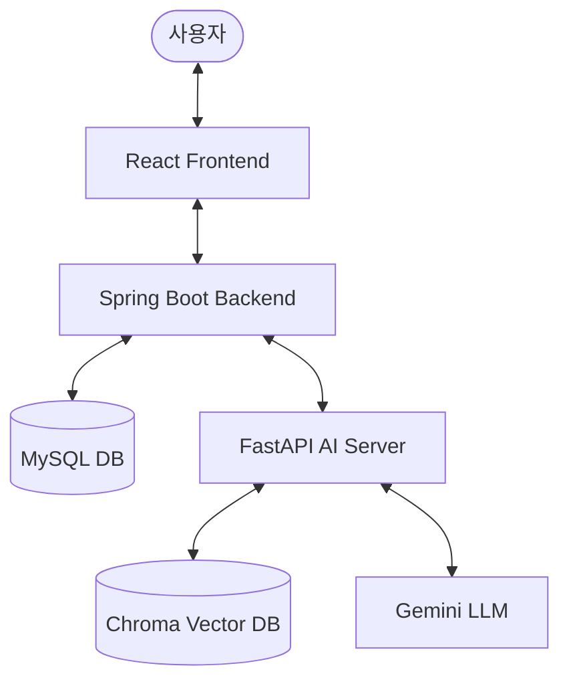

# 🎓 캡스톤 최종 발표 통합 마스터 가이드북

이 문서는 캡스톤 최종 발표(총 10분: **발표 8분 + 시연 영상 2분**)를 위해 **PPT 슬라이드 구성안, 스피치 대본, 시각 자료(Mermaid 다이어그램), 다이어그램 제작 팁, 교수님 기술 질문 대비 시나리오, 발표 준비 전략**을 하나로 통합한 최종 마스터 문서입니다.

---

## ⏱️ 발표 시간 배분표 (총 10분)
* **발표 스피치**: 표지 + 10개 슬라이드 / 총 8분 (480초)
* **시연 영상 재생**: 2분 (120초)

| 슬라이드 번호 | 내용 | 배정 시간 | 누적 시간 |
| :--- | :--- | :--- | :--- |
| **표지** | Title (표지) | 15초 | 15초 |
| **슬라이드 1** | 1. Motivation (배경 및 동기) | 45초 | 1분 00초 |
| **슬라이드 2** | 2. Limitation (of prior works) (기존 연구 한계) | 60초 | 2분 00초 |
| **슬라이드 3** | 3. Background (배경 지식) | 30초 | 2분 30초 |
| **슬라이드 4** | 4. 사용 기술 스택 (Tech Stack) | 30초 | 3분 00초 |
| **슬라이드 5** | 5. 시스템 아키텍처 & 흐름도 (Architecture & Flow) | 40초 | 3분 40초 |
| **슬라이드 6** | **6. 시연 영상 (System Demo Video)** | **2분 (120초)** | **5분 40초** |
| **슬라이드 7** | 7. 실제 성능 측정 및 비교 검증 (Evaluation) | 90초 | 7분 10초 |
| **슬라이드 8** | 8. Contribution of This Work (본 연구의 차별점) | 30초 | 7분 40초 |
| **슬라이드 9** | 9. 시행 착오 & 향후 과제 (Trials & Errors & Future Work) | 80초 | 9분 00초 |
| **슬라이드 10** | 10. Conclusion (결론 및 기대 효과) | 60초 | 10분 00초 |

---

## 🎨 다이어그램 및 설계도 제작 추천 사이트
발표 자료(PPT)에 넣을 그림과 아키텍처를 세련되게 그릴 수 있는 도구 목록입니다.
1. **아키텍처 및 흐름도**: [Draw.io](https://app.diagrams.net/) (Arrange > Insert > Advanced > Mermaid에 아래 코드 복사/붙여넣기 시 자동 완성)
2. **데이터베이스 스키마(ERD)**: [dbdiagram.io](https://dbdiagram.io/) (텍스트 정의만으로 세련된 DB 설계도 자동 생성)
3. **디자인 템플릿 및 인포그래픽**: [Figma](https://www.figma.com/) (풍부한 화면 설계 및 발표자료용 벡터 리소스 활용 가능)
4. **Mermaid 실시간 렌더링**: [Mermaid Live Editor](https://mermaid.live/) (즉시 렌더링 후 SVG/PNG 다운로드 가능)

---

## 🧭 파트 1: 10분 발표 슬라이드 구성 및 스피치 대본

### [표지] Title
* **슬라이드 구성**:
  - **제목**: RAG를 활용한 AI 정책 추천 플랫폼
  - **부제**: 의미론적 필터링과 오프라인 캐싱 기반의 개인화 정책 추천 및 마감 알림 서비스
  - **발표자**: 조원 일동 (발표자: 220041)
* **추천 시각 자료**: 스마트 AI 매칭 컨셉 일러스트 또는 다크 모드 기반의 고성능 대시보드 메인 UI 캡처본.
* **발표 대본**:
  > "안녕하세요. 'RAG를 활용한 AI 정책 추천 플랫폼' 발표를 맡은 220041입니다. 저희 플랫폼은 복잡한 자연어 자격 요건으로 인한 정보 탐색 장벽을 낮추고 복지 사각지대를 해소하고자 설계되었습니다. 발표 시작하겠습니다." (15초)

---

### [슬라이드 1] 1. Motivation (배경 및 동기)
* **슬라이드 구성**:
  - **쏟아지는 지원 정책**: 정부24, 복지로 등 청년·취약계층을 위한 지원 정책 급증.
  - **정보 탐색의 피로감**: 사이트 파편화로 수집 경로 분산.
  - **복잡한 자격 요건**: 본문에 숨겨진 나이, 학적, 소득 제한으로 인해 지원 자격 미달 및 신청 포기 빈번.
  - **최종 목표**: 정보 탐색 피로도 감소, 사각지대 해소, 정책 수혜율 향상.
* **추천 시각 자료**: 여러 포털 사이트 로고 파편화 및 자격 조건 앞에서 고민하는 유저 일러스트.
* **발표 대본**:
  > "Motivation입니다. 최근 정부24, 복지로 등 청년이나 취약계층을 위한 정책이 많이 쏟아지고 있습니다. 이로 인해 어떤 플랫폼을 선택할지 막막할 뿐만 아니라, 막상 들어가보면 복잡한 자격요건에 부합하지 않아 신청조차 못 하는 경우가 허다합니다. 저 역시 이러한 문제를 직접 겪으며 정보탐색 피로도 감소, 사각지대 해소, 수혜율 증가를 목표로 본 주제를 선택했습니다." (45초)

---

### [슬라이드 2] 2. Limitation (of prior works) (기존 연구 한계)
* **슬라이드 구성**:
  - **정부24 필터 한계**: 중복 선택 불가, 정보 저장 불가 및 인증 번거로움으로 접근성 저조.
  - **오추천 노이즈**: 가상 프로필 입력 시 84개 중 실제 자격 부합은 12개에 불과 (정밀도 **14.2%**). 일일이 확인해야 하는 인지 피로도 누적으로 정책 알림에 무감각화.
  - **기존 AI 챗봇 한계**: 단순 키워드 매칭에 그치며, 상세 주소에 대한 환각(Hallucination) 현상 발생.
* **추천 시각 자료**: 정부24 필터 검색 화면(84개 결과) 및 정밀도 14.2%를 강조하는 원형 그래프 차트.
* **발표 대본**:
  > "Limitation입니다. 정부24 '간편찾기'는 중복 선택 불가, 정보 저장 불가 및 인증 번거로움으로 접근성이 낮습니다. 특히 필터링 후에도 84개 정책이 노출되어 정밀도가 14.2%에 불과하며, 일일이 확인해야 해 피로도가 누적됩니다. 결국 정책 알림에 무감각해져 수혜 기회를 놓칩니다. 또한 기존 AI 챗봇은 단순 키워드 매칭에 그쳐 환각 현상이 심각합니다." (60초)

---

### [슬라이드 3] 3. Background (배경 지식)
* **슬라이드 구성**:
  - **RAG (Retrieval-Augmented Generation)**: 외부 DB에서 정책 원문을 먼저 검색해 LLM에 제공함으로써 환각 방지 및 답변 신뢰성 극대화.
  - **시맨틱 검색 (Semantic Search)**: 단어 불일치를 넘어 맥락과 의미를 벡터로 변환하여 의미적 유사도 계산.
  - **하이브리드 저장 구조**: 벡터 DB(ChromaDB)와 개인 프로필 및 알림 이력 관리용 RDB(MySQL)의 결합 설계.
  - **온보딩 (Onboarding)**: 사용자의 8대 핵심 프로필을 수집하여 개인화 추천의 기반을 다지는 입력 단계.
* **추천 시각 자료**: RAG 아키텍처 흐름도(검색 ➔ 컨텍스트 주입 ➔ LLM 답변) 및 하이브리드 DB 결합 다이어그램.
* **발표 대본**:
  > "Background입니다. 핵심 기술인 RAG는 외부 DB에서 정책 원문을 먼저 검색해 LLM에 제공하여 환각을 차단합니다. 시맨틱 검색은 의미적 유사도를 벡터로 계산하며, 하이브리드 저장은 검색용 벡터 DB인 ChromaDB와 유저 상태 관리를 위한 MySQL을 결합한 인프라입니다. 온보딩은 사용자의 8대 핵심 프로필을 사전에 수집하는 체계입니다." (30초)

---

### [슬라이드 4] 4. 사용 기술 스택 (Tech Stack)
* **슬라이드 구성**:
  - **Frontend**: **React** - SPA 기반의 동적 화면 전환으로 직관적인 온보딩 UI 및 대시보드 구현.
  - **Backend**: **Spring Boot (Java)** - JPA의 트랜잭션 안정성 및 스케줄러 배치를 통한 주기적 알림 자동 감지.
  - **AI Engine**: **FastAPI (Python)** - LangChain 연동 및 파이썬 기반 RAG 라이브러리의 비동기 고속 연산.
  - **Database**: 구조화 데이터 보존을 위한 **MySQL** 및 대용량 벡터 고속 검색을 위한 **ChromaDB**.
* **추천 시각 자료**: React, Spring Boot, FastAPI, MySQL, ChromaDB 로고 카드 레이아웃.
* **발표 대본**:
  > "사용 기술 스택입니다. 프론트엔드는 동적 UI를 위해 React를, 백엔드는 로직 안정성과 알림 스케줄링 배치를 위해 Spring Boot를 채택했습니다. RAG 파이프라인 연산은 Python 호환성과 비동기 속도가 우수한 FastAPI로 구축했고, 데이터베이스는 MySQL과 벡터 DB인 ChromaDB를 하이브리드로 구성했습니다." (30초)

---

### [슬라이드 5] 5. 시스템 아키텍처 & 흐름도 (Architecture & Flow)
* **슬라이드 구성**:
  - **시스템 아키텍처 다이어그램** (아래 Mermaid 참조)
  - **추천 파이프라인 4단계**:
    1. **ChromaDB 검색**: 코사인 유사도 기반 후보군 25개 1차 추출.
    2. **하드 필터링**: 규칙 기반 거주 지역 및 마감 공고 선제 제외.
    3. **LLM 정밀 검증**: Gemini가 나이·소득 조건을 대조하여 1:1 맞춤 추천/탈락 사유 도출.
    4. **GT Override**: 공식 원문 데이터와 pre-resolved 상세 링크 캐시로 환각 최종 보정.
* **추천 시각 자료**: 프론트-백-AI-DB가 결합된 아키텍처 다이어그램 및 4단계 추천 파이프라인 흐름도.
* **Mermaid 다이어그램**:

* **발표 대본**:
  > "시스템 아키텍처 및 흐름도입니다. 유저 입력 데이터는 백엔드를 거쳐 AI 서버로 전달됩니다. AI 서버는 ChromaDB에서 관련 정책을 검색하고, 지역 및 마감일을 1차 하드 필터링합니다. 이후 Gemini LLM이 나이, 소득 자격을 상세히 대조 검증하여 추천/탈락 사유를 도출하고, 공식 원문 링크 메타데이터를 활용해 링크 왜곡을 보정하여 화면에 즉각 반환합니다." (40초)

---

### [슬라이드 6] 6. 시연 영상 (System Demo Video)
* **슬라이드 구성**:
  - **시연 동영상 화면 (.mp4)** (2분 분량 자동 재생)
  - **시연 핵심 프로세스**:
    1. **온보딩 폼 입력**: 다중 조건 특수 우대 사항 및 보유 서류 제출.
    2. **AI 대시보드 결과 확인 (0ms 지연)**: 맞춤형 추천 결과 리스트 및 1:1 추천/탈락 사유와 제출 서류 대조 결과 즉시 로딩.
    3. **마이페이지 관심 등록**: 공고 신청 상태 변경 및 관리.
    4. **알림 수신**: D-7, D-1, D-Day 감지 및 알림 메일 즉시 수신.
* **추천 시각 자료**: 중앙에 시연 비디오 플레이어(.mp4) 및 우측에 4단계 시연 흐름 요약 카드.
* **발표 대본**:
  > "시연 영상입니다. 사용자가 다중 온보딩 및 보유 서류 조건을 입력해 매칭을 시작하면, 대기 없이 대시보드로 진입합니다. 각 카드에는 AI가 자격을 심사한 1:1 추천/탈락 사유와 필수 서류 대조 결과가 제공됩니다. 관심 정책 등록 시, 백엔드 배치가 마감일(D-7, D-1, D-Day)을 체크하여 메일로 다이렉트 상세 신청 링크가 포함된 스마트 마감 알림을 자동 발송합니다." (120초)

---

### [슬라이드 7] 7. 실제 성능 측정 및 비교 검증 (Evaluation)
* **슬라이드 구성**:
  - **정부24 vs 개발 플랫폼 정밀도 대조**:
    - **가상 프로필**: 대학생, 만 24세, 미취업, 부모 소득 중위 150% 이하.
    - **정부24**: 84개 추천 중 실제 부합은 단 12개 (정밀도 **14.2%**).
    - **개발 플랫폼**: RAG 필터링을 통해 자격 미달 72개 사전 제거 (정밀도 **100%** 달성).
  - **탐색 시간 절감**: 정보 정독 및 확인 시간 168분에서 **24분으로 축소** (**약 85% 시간 절감**).
  - **데이터베이스 영구 적재**: MySQL `users`, `user_specials`, `policy_intents` 테이블 적재 상태 검증.
* **추천 시각 자료**: 정부24 vs 개발 플랫폼 정밀도 비교 바 차트(14.2% vs 100%), 탐색 시간 절감(85%) 그래프, MySQL `policy_intents` 테이블 조회 캡처 화면.
* **발표 대본**:
  > "실제 성능 측정 및 비교 검증입니다. 가상 대학생 프로필을 대입해 정부24와 비교했습니다. 정부24는 84개 추천 중 실제 부합 공고가 12개에 그쳐 정밀도 14.2%였으나, 저희 플랫폼은 부적합 조건 72개를 사전 차단해 정밀도 100%를 달성하고 탐색 시간도 85% 절감했습니다. 또한 MySQL `policy_intents` 테이블에 맞춤형 한글 추천/탈락 사유 및 조건이 정상 적재됨을 데이터베이스상으로 증명했습니다." (90초)

---

### [슬라이드 8] 8. Contribution of This Work (본 연구의 차별점)
* **슬라이드 구성**:
  - **1. 하이브리드 RAG 인프라**: ChromaDB의 의미론적 벡터 검색과 MySQL의 데이터베이스를 결합하여 무결성과 검색 정밀성 동시 확보.
  - **2. 설명 가능한 추천 사유의 1:1 개인화**: 단순 매칭을 넘어 '왜 추천되었는지, 왜 탈락했는지' 설명성(XAI) 부여.
  - **3. 선제 링크 수집(Pre-resolution) 및 오프라인 캐싱**: 실시간 크롤링 병목을 완전 차단하여 온보딩 추천 반응 속도를 **0ms** 수준으로 즉각 단축.
* **추천 시각 자료**: 하이브리드 RAG, XAI 개인화 사유, Pre-resolved Cache 3가지를 정리한 3단 요약 카드 디자인.
* **발표 대본**:
  > "Contribution입니다. 첫째, RDB와 벡터 DB를 연동해 데이터 무결성과 검색 속도를 조화롭게 설계한 하이브리드 인프라입니다. 둘째, 개별 정책마다 1:1 자연어 자격 심사 근거를 제시하여 설명 가능한 추천을 구현했습니다. 셋째, 실시간 크롤링 병목을 오프라인 pre-resolve 캐시로 차단하여 추천 반응 속도를 0ms 수준으로 즉각 단축시켰습니다." (30초)

---

### [슬라이드 9] 9. 시행 착오 & 향후 과제 (Trials & Errors & Future Work)
* **슬라이드 구성**:
  - **시행착오 및 극복 과정**:
    - *화면 지연*: Selenium 실시간 수집 지연 ➔ 오프라인 링크 캐시 `policy_links.json` 선제 구축으로 극복 (지연 **0ms**).
    - *LLM 환각*: 허위 신청 주소 및 정보 왜곡 ➔ 공식 원문 메타데이터로 강제 오버라이딩하는 **Ground-Truth Override** 모듈 탑재.
  - **보완해야 할 향후 과제**:
    - 푸시 수신성 강화를 위해 메일 알림을 카카오 알림톡 등 모바일 채널로 다양화.
    - 예외 규칙 로직 고도화 및 세밀한 조건 분류를 통해 매칭의 완성도 제고.
* **추천 시각 자료**: 시행착오(지연, 환각)와 해결방안(캐싱, GT-Override), 향후과제(알림 채널 다변화) 대조 3단 레이아웃.
* **발표 대본**:
  > "시행 착오 및 향후 과제입니다. 실시간 크롤링 지연(10초)은 오프라인 링크 캐시 선제 수집으로, AI 링크 생성 환각은 팩트 데이터 강제 보정(GT-Override) 모듈로 극복했습니다. 향후 과제는 이메일 알림을 카카오 알림톡 등 모바일 채널로 다양화하는 것과 예외 규칙 로직을 고도화하여 매칭의 완벽성을 높이는 것입니다." (80초)

---

### [슬라이드 10] 10. Conclusion (결론 및 기대 효과)
* **슬라이드 구성**:
  - **수동적 검색 ➔ 능동적 알림**: 매일 정책 포털을 직접 헤매는 검색 방식 대신 AI 비서가 알아서 기한과 혜택을 챙겨주는 지능형 능동 알림 서비스.
  - **정보 격차 및 사각지대 차단**: 요건 확인에 취약한 소외 계층에게 자연어 사유와 서류 체크리스트를 제공해 정보 불균형 적극 해소.
  - **실무 적용 가능한 RAG 추천 모델**: LLM의 단점인 속도 및 환각을 극복하여 즉각 상용화 가능한 고성능 하이브리드 아키처 실증.
* **추천 시각 자료**: AI 비서가 알아서 혜택을 챙겨주는 능동형 알림 행정의 가치 전달 및 최종 메시지 인포그래픽.
* **발표 대본**:
  > "Conclusion입니다. 본 시스템은 소모적 검색 대신 AI가 마감일과 자격을 챙기는 능동형 복지 알림 모델을 제시했습니다. 이는 정보 격차와 복지 사각지대를 해소하고 수혜율을 높일 것입니다. 특히 RAG의 고질적 문제인 로딩 속도 지연과 환각을 아키텍처 및 캐싱 장치로 해결해 즉시 실무에 적용 가능한 상용화 수준을 입증했습니다. 감사합니다." (60초)

---

## ⚙️ 파트 2: 핵심 코드의 작동 흐름과 기술 의사결정 (교수님 방어용)

우리 프로젝트의 전체 작동 흐름을 3대 핵심 단계별 코드로 쪼개어 설명합니다. **"왜 이 기술/모델/설계를 사용했는가?"**에 대한 완벽한 답변 시나리오를 심어두었습니다.

```
[동작 흐름도]
사용자 온보딩 (React)
    ↓ (8대 조건 + 다중 체크박스 전달)
Spring Boot 백엔드 (MySQL 정보 동기화)
    ↓ (WebClient POST /match 요청)
FastAPI AI Coprocessor
    ↓ 1. ChromaDB 유사도 검색 (상위 80개 추출)
    ↓ 2. 1차 마감 공고 차단 필터 (RAG 단계)
    ↓ 3. Gemini 문맥 독해 및 조건 대조
    ↓ 4. 2차 마감/링크 강제 보정 (Post-Processor)
Spring Boot 백엔드 (서류함 자동 대조 & DB 저장)
    ↓ (최종 결과 반환)
React 대시보드 표출 (데스크톱 푸시 및 챗봇 서비스 활성화)
```

---

### 1️⃣ 단계: AI Coprocessor (FastAPI `main.py`)
AI와 관련된 임베딩, 벡터 검색, LLM 연산은 파이썬 서버가 처리합니다.

```python
# [main.py 중 - RAG 필터링 및 매칭 부분]
@app.post("/match")
async def match_policies(p: UserRequestModel):
    # ChromaDB에서 관련 정책 후보 80개 대량 검색
    relevant_docs = vectorstore.similarity_search(search_terms, k=80)
    
    # 💡 [1차 필터링 - RAG 단계] 마감된 정책의 청크는 프롬프트 컨텍스트에서 아예 배제
    active_docs = []
    for doc in relevant_docs:
        # 공고문 첫 줄에서 정책 제목 추출 후 마감일이 오늘 이전(expired)이면 배제
        ...
        if not is_expired:
            active_docs.append(doc)
            
    context = "\n\n".join([doc.page_content for doc in active_docs])
    result = structured_llm.invoke(prompt)
```

#### 🧐 Q. 왜 Java(Spring) 하나로 다 짜지 않고 FastAPI(Python)와 하이브리드로 분리했나요?
* **답변 시나리오**: 
  > *"가장 큰 이유는 **생태계의 적합성**과 **성능**입니다. LangChain, HuggingFace의 Sentence-Transformers, ChromaDB 등 현대 AI 및 LLM 라이브러리는 **파이썬에 최적화**되어 있습니다. Java 진영에도 LangChain4j 같은 대안이 존재하지만, 로컬 임베딩 모델을 자바 런타임 내에서 구동하기에는 메모리 누수와 라이브러리 미성숙 문제가 있었습니다. 따라서 회원가입, 서류함 상태 관리 등 **기존의 안정적인 트랜잭션 처리는 Spring Boot(JPA/MySQL)**에 맡기고, 대용량 벡터 서치 및 자연어 독해는 **FastAPI(Python)**로 구축해 마이크로서비스 형태로 통신하는 구조를 선택하여 각 언어와 프레임워크의 장점만을 취했습니다."*

#### 🧐 Q. 왜 OpenAI GPT-4o를 쓰지 않고 Gemini를 선택했나요?
* **답변 시나리오**:
  > *"우리의 매칭 시스템은 정확도를 극대화하기 위해 ChromaDB에서 상위 80개의 문서 청크(약 4만자 분량)를 통째로 긁어와 AI에게 제공(RAG)합니다. **GPT-4o**의 경우 토큰당 비용이 매우 비싸고 실시간 매칭 시 API 지연 시간(Latency)이 5~8초 이상 소요되어 웹 서비스에 부적합했습니다. 반면 **Gemini**는 100만 토큰에 달하는 압도적인 컨텍스트 윈도우를 기본 제공하며, 속도가 빠르고 비용 효율성이 극도로 높아 대용량 RAG 매칭에 가장 최적인 대안이라고 판단하여 선택했습니다."*

#### 🧐 Q. 벡터 데이터베이스로 왜 굳이 ChromaDB를 선택했나요?
* **답변 시나리오**:
  > *"대중적인 벡터 DB인 Pinecone이나 Milvus는 별도의 클라우드 가입이나 Docker 컨테이너 서버를 상시 가동해야 하므로 인프라 관리 비용이 든다는 단점이 있습니다. 반면 **ChromaDB는 로컬 임베디드 모드(SQLite 기반)**로 동작하여 별도의 외부 서버 가동 없이 프로젝트 내부 디렉토리에 데이터를 영구 보관할 수 있습니다. 또한, 메타데이터 필터링 기능이 기본적으로 우수하여 텍스트 원문 소스 파일명을 역추적하고 실시간으로 가공하기에 가장 적합하여 선택했습니다."*

---

### 2️⃣ 단계: 서비스 중계 및 서류함 자동 대조 (Spring Boot `PolicyService.java`)
AI의 결과물을 받아 사용자 개인의 서류와 1:1로 비교하고 DB에 영속화합니다.

```java
// [PolicyService.java 중 - 서류 대조 분석 부분]
List<String> reqDocs = dto.required_documents();
List<String> ownedDocs = new ArrayList<>();
List<String> missingDocs = new ArrayList<>();

if (reqDocs != null) {
    for (String doc : reqDocs) {
        boolean isOwned = false;
        if (doc != null) {
            String normalizedDoc = doc.replace(" ", ""); // 💡 공백 제거 정규화
            for (String ownedDoc : ownedDocsSet) {
                if (ownedDoc != null) {
                    String normalizedOwned = ownedDoc.replace(" ", "");
                    if (normalizedDoc.contains(normalizedOwned) || normalizedOwned.contains(normalizedDoc)) {
                        isOwned = true; // 유연 매칭 성공
                        break;
                    }
                }
            }
        }
        if (isOwned) ownedDocs.add(doc);
        else missingDocs.add(doc);
    }
}
```

#### 🧐 Q. 이 서류 대조 로직에서 왜 단순 String 동등 비교(`equals`)를 쓰지 않았나요?
* **답변 시나리오**:
  > *"실제 공고문에는 `주민등록 등본`, `주민등록등본 1부`, `초본` 등 띄어쓰기나 서식이 다양하게 적혀있고, 사용자는 `주민등록등본` 형태로 서류를 저장합니다. 만약 `equals`를 썼다면 띄어쓰기 하나 때문에 불일치 판정이 날 것입니다. 이를 방지하기 위해 **공백을 완전히 제거하는 정규화(`replace(" ", "")`)** 과정을 거친 후, 상호 간에 문자열이 포함(`contains`)되어 있는지를 양방향으로 검사하는 유연 매칭 알고리즘을 설계하여 **서류 판정의 정합성을 보장**했습니다."*

---

### 3️⃣ 단계: 다중 온보딩 및 알림 UI (React `App.jsx`)
사용자가 접하는 UI와 카카오톡 스타일 토스트 팝업, 그리고 발표 데모 제어판을 렌더링합니다.

```javascript
// [App.jsx 중 - D-day 알림 로직 및 카톡 토스트 팝업 호출]
const fetchDDayAlerts = async (user = username, triggerPush = false) => {
  const response = await axios.get('http://localhost:8080/api/policies/alerts', { params: { username: user } });
  setAlerts(response.data);

  if (triggerPush && response.data.length > 0) {
    // 1) HTML5 Web Notification API 발송 (브라우저 외부 푸시)
    if ('Notification' in window && Notification.permission === 'granted') {
      sendNotifications(response.data);
    }
    // 2) 카카오톡 스타일 노란색 토스트 알림 시각화
    response.data.forEach((alert, idx) => {
      setTimeout(() => {
        triggerKakaoToast(alert.title, alert.daysLeft);
      }, idx * 1200);
    });
  }
};
```

#### 🧐 Q. 브라우저 외부 알림(HTML5 Web Notification)을 굳이 도입한 이유는 무엇인가요?
* **답변 시나리오**:
  > *"기존 행정 알림은 사용자가 웹 사이트 화면을 켜놓고 보고 있을 때만 작동하는 인앱 알림(In-app Notification)에 국한되어 있었습니다. 이는 사용자가 사이트를 끄면 무용지물이 됩니다. 반면 **HTML5 Web Notification API**를 활용하면 사용자가 브라우저 탭을 최소화하거나 다른 작업을 하고 있는 와중에도 데스크톱 우측 하단에 시스템 푸시 알림을 띄울 수 있어, **마감 임박 정책의 인지율을 극대화**하는 능동형 보완 체계를 구현할 수 있었습니다."*

---

## 💡 파트 3: 이틀 간 발표 준비를 위한 타임라인 전략

남은 시간 동안 당황하지 않고 완벽하게 준비할 수 있는 스케줄러입니다.

### 📅 D-2 (발표 이틀 전 - PPT 초안 작성 및 테스트 완료)
1. **PPT 초안 작성**: 위의 **[Motivation ~ Conclusion]** 10대 목차 양식 텍스트를 활용하여 슬라이드를 구성합니다. 
2. **데모 작동 테스트**:
   * 로컬 서버(Vite, Spring Boot, FastAPI)를 켭니다.
   * 사이트에 로그인한 뒤 대시보드 상단에 새로 생긴 **`[🛠️ 캡스톤 최종 발표 데모 & 알림 테스트 제어판]`**을 클릭해 봅니다.
   * **`[🎯 1초 다중매칭 정책 주입]`** 버튼을 눌러 카드가 튀어나오고 브라우저 권한 팝업과 노란색 카톡 팝업이 예쁘게 뜨는지 확인합니다.
3. **데모 화면 녹화**: 만약의 사태를 대비해, 위 데모가 성공적으로 도는 화면을 **OBS Studio나 Windows 녹화 도구(Win + Alt + R)**로 1~2분 정도 녹화하여 동영상 파일로 저장해 둡니다.

### 📅 D-1 (발표 하루 전 - 리허설 및 PPT 장표 다듬기)
1. **슬라이드에 영상 삽입**: PPT 슬라이드 중간(슬라이드 6)에 녹화해 둔 데모 영상을 삽입합니다. (라이브 세팅 에러 대비 필수!)
2. **10분 타임 트래킹 리허설**: 혼자서 폰 스톱워치를 켜놓고 말을 해봅니다. 
   * 슬라이드 브리핑에 **8분**, 데모 및 영상 재생에 **2분**을 배분하여 연습합니다.
3. **체크박스 차별성 강조 연습**: *"정부 24는 최대 2개이지만 우리는 무제한으로 10개 이상 중복 체크가 가능하다"* 는 멘트를 발표할 때 힘주어 말하는 연습을 합니다.

### 📅 D-Day (발표 당일 - 현장 방어)
* USB 드라이브에 **PPT 파일**과 **데모 비디오 파일(.mp4)**을 같이 담아가서 강단 컴퓨터에 복사해 둡니다.
* 라이브 세팅 시간이 1분 이상 지체되면 미련 없이 준비한 영상을 틀고 발표를 매끄럽게 이어가십시오. 교수님들은 침착하고 완벽하게 준비된 모습에 훨씬 더 높은 점수를 줍니다.
